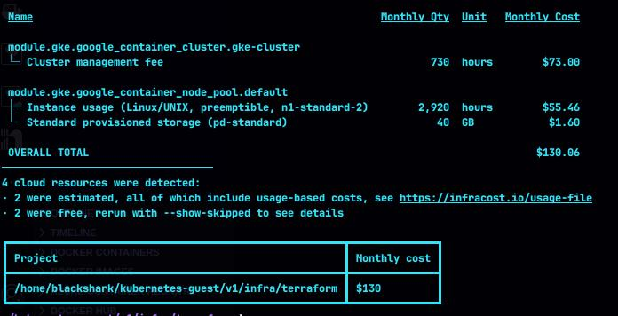

# Kubernetes Challenge

### Kubernetes Resume Challenge 2024

Welcome to my journey through the **kodekloud** Kubernetes challenge. In this project, I embarked on building a modern application infrastructure using cutting-edge technologies. Here's the documentation of my journey where I applied all my skills.

#### Technologies Used

- Docker
- Kubernetes
- Horizontal Pod Autoscaling
- Google Cloud (GKE)
- Terraform
- Istio Service Mesh
- Prometheus, Grafana, Kiali for monitoring

The objective of this application is to be scalable and **cloud-native**, which is why these technologies were chosen, offering the following advantages:

- Autoscaling based on demand with HPA
- Leveraging Kubernetes enables the application to be cloud-native and scalable to handle large volumes.
- Terraform (IaC) facilitates infrastructure replication and management through code.
- Istio (Service Mesh) enables communication and connection between our microservices while adding security to our application and cluster.
- Monitoring: Having observability and monitoring is crucial for the operation of microservices and a modern application like one built with Kubernetes.

This provides a clearer definition of the system's advantages.

<br>

## Infrastructure Diagram


## Cost Estimation with Infracost




<br>

## Implementation

### (Local) Docker and Docker Compose

To get our application up and running locally, follow these steps:

###### Understanding the Dockerfiles

##### [Database](https://hub.docker.com/r/d4rkghost47/kodekloud-eccomerce-db)

We'll start with the database our application will use. We'll use the base MySQL image and proceed to configure it by loading initial data and creating the necessary user for our application. Folder structure for `db`:


```bash
/app/db
 .
├──  db-load-script.sql
└──  Dockerfile
```

<br>

##### [Web Server](https://hub.docker.com/r/d4rkghost47/kodekloud-eccomerce)

For this, I decided to take on a more challenging task of setting up the Apache server where the PHP application would be hosted from scratch, using the Ubuntu base image and installing the necessary dependencies for the application.

I want to mention how proud I am of completing this part. From my perspective, this was the most difficult step, as I'm used to languages like Java with Spring, which have their built-in server. It was quite a challenging but gratifying task to see it work!

```bash
/app
 .
└──  Dockerfile
```

This was configured so that changes can be made to the project and seen reflected as we compile the image.

##### Compiling the project

Now that we've seen how the images work, let's move on to the docker-compose file, which contains the combination of the two services we've seen before:

```bash
/app
 .
└──  docker-compose.yaml
```

To run the application, follow these steps:

1. Port Configuration (Optional): Set a port of your choice:

```bash
version: '3'

services:
  web:
    container_name: web
    build: 
      context: .
      dockerfile: Dockerfile
    ports:
    - "{PORT}:80"       <--- puerto de nuestra pc

    ...


  db:
    container_name: db
    build:
      context: ./db
      dockerfile: Dockerfile
    ports:
      - "{PORT}:3306"   <--- puerto de nuestra pc

```


2. Compiling and running our application with:


```bash
docker-compose up --build
```

3. Checking that our application works: You can execute curl localhost:{PORT} or open your web browser and search for localhost:{PORT}.


Great! We see that our application is running!

<br>


### (Cloud) Google Cloud and Kubernetes

Now, let's see where our application really shines in a cloud-based environment. For this, we'll need to follow a series of steps where we'll use some of the most common infrastructure automation tools like **bash** and **Terraform**.

Requirements:

- Linux-based PC
- Installed Terraform
- GCP Account

Are you ready? Let's get started!


1. Infrastructure Creation with Terraform: Head to `infra/terraform`, where we'll find the infrastructure setup:

```bash
/infra/terraform
 .
├── 󱁢 backend.tf
├── 󱁢 main.tf
├──  modules
│   └──  cluster
│       ├── 󱁢 cluster.tf
│       ├── 󱁢 output.tf
│       ├── 󱁢 variables.tf
│       └── 󱁢 vpc.tf
├── 󱁢 output.tf
├── 󱁢 providers.tf
├──  terraform.tfvars
└── 󱁢 variables.tf

```

To get it started, we'll need to edit the variables file and main file (optional) and configure the parameters as desired:


```bash
/infra/terraform
 .
└── 󱁢 variables.tf


cat variables.tf

variable "prefix" {
  type        = string
  description = "Prefijo para los recursos"
  default     = "kodekloud-"
}

variable "google_project_id" {
  type        = string
  description = "ID del proyecto de GCP"
}

variable "credentials_file" {
  type = string


/infra/terraform
 .
└── 󱁢 main.tf

cat main.tf

### Infraestructure

module "gke" {
  source = "./modules/cluster"

  # Creacion de la VPC y subnet para el cluster

  google_project_id = var.google_project_id

  vpc_name = "${var.prefix}gke-main"

  subnet_name = "${var.prefix}gke-subnet"

  vpc_location = var.vpc_location

  subnet_cidr_range = var.subnet_cidr_range

```

Here, we can configure the names of our infrastructure.

Then, we'll configure the `terraform.tfvars file`, where we'll add our sensitive data like the path to the credentials file and the ID of our **GCP project**:

```bash
/infra/terraform
 .
└── 󱁢 terraform.tfvars


cat terraform.tfvars

google_project_id = "{ID}"
credentials_file  = "./path/to/createndials.json"
```

After that, we'll execute a `terraform apply` and watch as our infrastructure starts to be created (this can take around 10 mins) until our infrastructure is fully created.